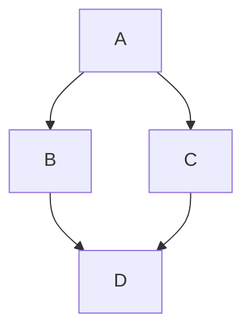
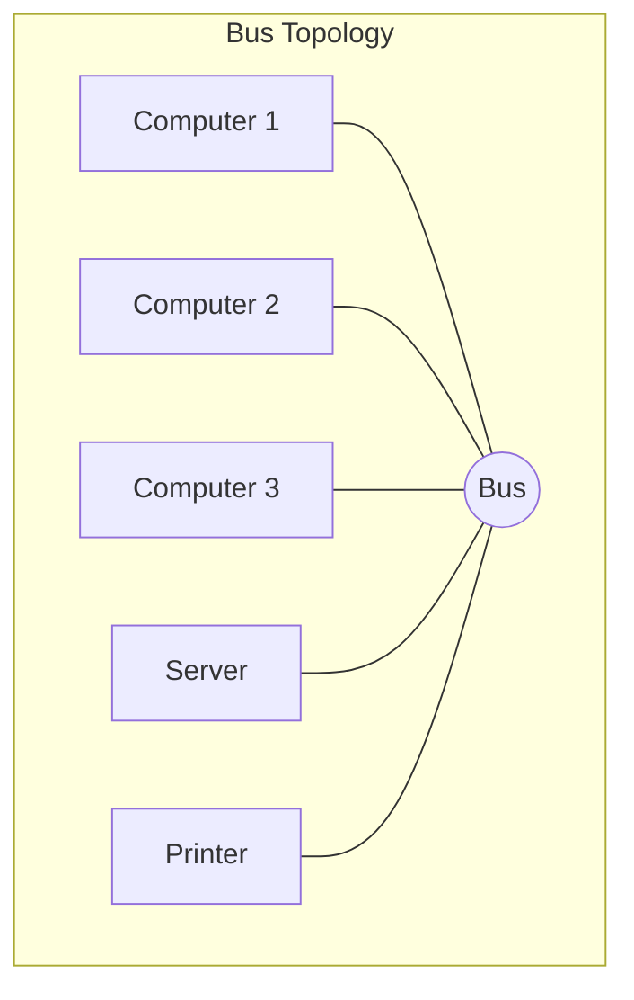
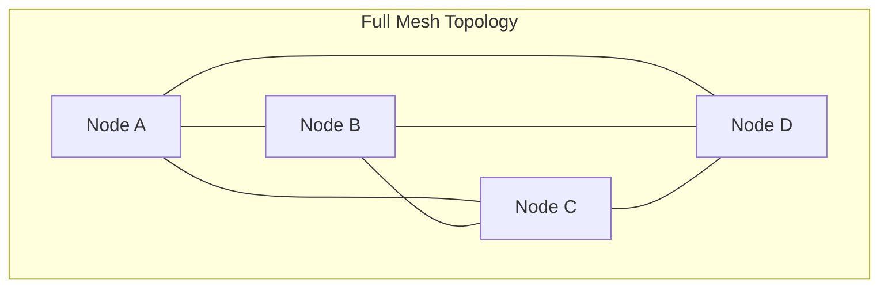
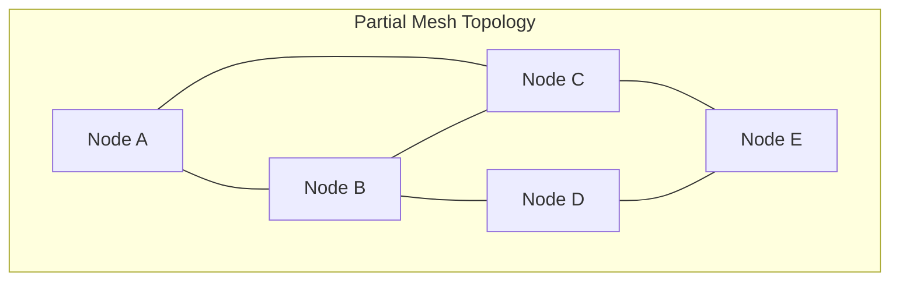
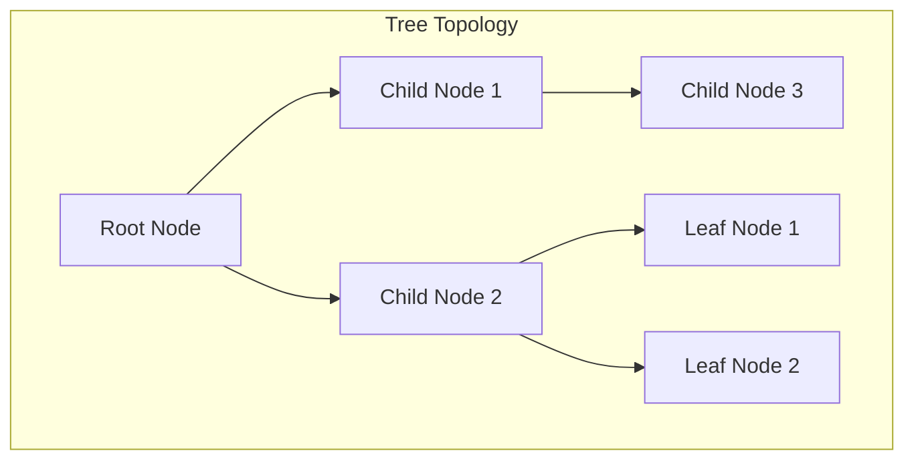

# 简介

## 概述

### 什么是计算机网络

从根本上说，计算机网络（Computer Network）是一个由两台或多台相互连接的计算设备组成的系统，其核心目的是交换数据和共享资源。这些设备，被称为 **网络节点（Node）**，可以是个人计算机、服务器、智能手机、打印机等终端设备（Data Terminal Equipment, DTE），也可以是路由器、交换机等专门用于数据通信的设备（Data Communication Equipment, DCE）。

连接这些节点的媒介被称为 **链路（Link）**，它可以是物理的，如铜质的双绞线电缆或玻璃制成的光纤；也可以是无线的，利用自由空间传输电磁波。当一个设备能够通过这些链路与另一个设备交换信息时，无论它们之间是否存在直接的物理连接，都可以认为它们已经构成了一个网络。

为了确保这些不同类型的设备能够相互理解并成功通信，它们必须遵守一套共同的规则，这套规则就是 **通信协议（Communication Protocol）**。协议定义了数据应该如何被格式化、寻址、传输、路由以及在目的地如何被接收和处理。

一个完整的计算机网络可以被定义为：一个将地理位置不同、具有独立功能的多个计算机系统，通过通信设备和线路连接起来，在网络软件（尤其是协议）的管理和协调下，实现资源共享和信息传递的系统。

### 什么是分组交换

要真正理解现代网络（尤其是互联网）的运作方式，就必须掌握其核心的 **分组交换（Packet Switching）**传输机制。理解这一抽象概念最有效的方法，莫过于将其与我们所熟知的邮政系统进行类比。  

- **数据分包（Packetization）**：想象一下，您需要邮寄一部很厚的书籍。如果试图将其作为一个巨大而笨重的包裹一次性寄出，会非常不便。一个更高效的方法是，将书一页一页地拆开，把每一页都放进一个标准尺寸的信封里。在网络世界中，一封电子邮件、一张图片或一段视频等大块数据，在发送前会被分割成许多个标准化的、大小适中的数据单元，这些单元就叫做 **分组** 或 **包（Packet）**。

- **寻址（Addressing）**：每一个信封上都必须清晰地写明收件人地址和寄件人地址。同样地，每个数据包也都包含一个 **包头（Header）**，其中包含了控制和路由所需的元数据。最重要的元数据就是 **源IP地址** 和 **目的IP地址**，它们相当于网络世界中计算机的唯一门牌号。

- **路由（Routing）**：当您将所有信封投递到邮筒后，没有任何一个邮政工作人员需要知道从您家到收件人家的完整路径。这些信件会从一个邮局被转发到下一个邮局，在每一个中转站，工作人员会根据信封上的地址决定下一个最佳投递点，使其离最终目的地更近一步。这正是网络中 **路由器（Router）** 的工作方式。路由器检查每个数据包的目的IP地址，并根据其内部的路由表，决定将该数据包转发到哪一个相邻的路由器，从而一步步地接力，直至送达目标计算机。由于网络状况（如拥堵或故障）是动态变化的，每个数据包所经过的路径都可能不尽相同。

- **重组（Reassembly）**：收件人最终会收到全部的信封，他需要将所有书页按照正确的页码顺序重新组合起来，才能阅读整本书。同样，接收方的计算机会收集所有到达的数据包，并根据包头中的序列号信息，将它们按正确的顺序重新组装，还原成原始的电子邮件或图片。这个确保数据有序、完整到达的任务，主要由我们稍后将要学习的传输控制协议（TCP）来完成。

这个类比不仅仅是一个教学工具，它揭示了互联网设计的核心哲学：通过去中心化实现韧性。邮政系统的类比清晰地表明，网络中没有一个中央权威控制着信息传递的全程。每个路由器（邮局）都只根据本地信息做出独立的、下一跳的转发决策。这意味着，如果某条路径（道路）发生拥堵或被摧毁，后续的数据包可以被动态地、自动地绕行其他路径。这种设计直接源于其前身 ARPANET 的军事需求——创建一个在部分节点被核攻击摧毁后仍能继续通信的网络。因此，分组交换这种看似简单的技术机制，是实现网络去中心化、高容错性和高健壮性这一战略目标的直接技术体现，也是互联网能够扩展到全球规模并保持稳健运行的根本原因之一。

### 计算机网络的作用

**资源共享**

网络允许多个用户共享同一台打印机、扫描仪或大容量磁盘驱动器，从而极大地节约了成本。例如，办公室里无需为每台电脑都配备一台打印机，只需将一台打印机接入网络，所有人便可共享使用。在现代，资源共享的概念已进一步扩展到共享软件许可证、集中存储的数据和计算能力。将数据集中存储在服务器上，不仅便于统一管理、备份和保障安全，也释放了个人计算机宝贵的存储空间。

**信息交换**

计算机网络为用户提供了一种便捷的信息交换方式，包括但不限于：

- **电子邮件（Email）**：以电子方式收发信件、文档和图片，是互联网最早也是至今最普及的应用之一。

- **万维网（World Wide Web, WWW）**：一个由无数互相链接的超文本文档和多媒体资源组成的全球性信息系统。用户通过浏览器访问网站，获取新闻、学习知识、进行娱乐。值得强调的是，互联网（Internet）和万维网（WWW）并非同一概念。互联网是承载数据的全球性 **物理网络基础设施**，而万维网是运行在互联网之上的一个 **信息服务**。

- **文件传输（File Sharing）**：通过FTP等协议，在不同计算机之间高效地传输文件。

- **即时通信与社交媒体**：允许用户进行实时的文字、语音和视频交流，构建起庞大的社交网络。

- **数字音视频流**：在线观看电影、收听音乐，改变了传统媒体的分发模式。

**分布式计算**

计算机网络使得分布式计算成为可能。通过将计算任务分散到多台计算机上，可以显著提高处理速度和效率。例如，科学研究中常用的 **集群计算（Cluster Computing）** 和 **网格计算（Grid Computing）**，允许多个独立的计算机协同工作，共同解决复杂问题。

**系统可用性**

计算机网络通过冗余和故障转移机制，提高了系统的可用性。例如，在一个企业网络中，关键服务器可以配置为冗余备份，当主服务器发生故障时，备份服务器可以立即接管服务，确保业务连续性。此外，负载均衡技术可以将用户请求分散到多台服务器上，避免单点故障，提高系统的整体性能和可靠性。

随着技术的发展，网络的作用早已超越了最初的设想，成为现代商业运作不可或缺的 **关键基础设施**。对于企业而言，网络是其实现数字化转型、提升竞争力的核心引擎。特别是在云计算时代，网络本身也成为一种可以按需分配的资源。企业可以通过 **云网络（Cloud Networking）**，在公有云或私有云平台上动态地创建虚拟路由器、防火墙，并按需获取带宽，从而极大地提升了业务部署的灵活性、可扩展性并有效控制了成本。现代网络解决方案通过软件定义、自动化和智能监控，不仅提供了连接，更保障了业务的连续性、数据的安全性，是企业在激烈市场竞争中取得成功的基石。

## 计算机网络的组成

网络硬件是构成网络的可触摸实体，大致可分为终端设备、传输介质和互联设备三类。

### 硬件

网络硬件是构成网络的可触摸实体，大致可分为终端设备、传输介质和互联设备三类。

**终端设备（End Devices）**

终端设备，也称为数据终端设备（DTE），是网络信息的最终源头和归宿，是用户直接交互的对象。常见的终端设备包括：

- **个人计算机（PC）与服务器（Server）**：最常见的网络节点，既可以是请求服务的客户端，也可以是提供服务的服务器。  
- **智能手机与平板电脑**：移动互联网时代的主要接入设备。
- **网络打印机与扫描仪**：通过网络实现资源共享的典型外设。
- **物联网（IoT）设备**：如智能家居设备、传感器等，它们构成了日益庞大的网络边缘。

**传输介质（Transmission Media）**

传输介质是连接网络节点的物理通道，其特性直接影响网络的性能、成本和部署范围。

- **双绞线（Twisted Pair）**：由两根相互缠绕的绝缘铜导线组成，缠绕的目的是为了减少来自外部的电磁干扰和线对之间的串扰 。它是目前局域网（LAN）中最常用、最经济的传输介质。  
- **光纤（Optical Fiber）**：通过在纤细的玻璃或塑料纤维中传输光脉冲来传递信息。它是目前性能最优越的传输介质。

**互联设备（Interconnecting Devices）**

互联设备，也称为数据通信设备（DCE），负责连接网络中的各个节点，并对数据流进行管理、转发和控制。

- **网络接口卡（Network Interface Card, NIC）**：俗称 **网卡**，是计算机连接到网络的接口硬件。

- **调制解调器（Modem）**：俗称 “猫”，其作用是进行信号的 **调制（Modulation）** 和 **解调（Demodulation）**，将计算机输出的数字信号转换（调制）成能够在线缆（如电话线、同轴电缆）上传输的模拟信号或另一种数字信号；同时，它将接收到的信号转换（解调）回计算机能识别的数字信号。

- **交换机（Switch）**：是一种工作在 **OSI模型数据链路层** 的智能设备，用于连接同一局域网内的多个终端设备。

- **路由器（Router）**：是一种工作在 **OSI模型网络层** 的、更为复杂的设备。用于连接不同的网络（如局域网和广域网），并根据数据包的目的地址决定最佳转发路径。

### 软件

**网络操作系统**

专门为管理网络资源、提供网络服务而设计的操作系统。目前的个人计算机操作系统都内置了网络功能，但却仍然和 Windows Server、Linux 等专门的网络操作系统有着本质的区别。其主要功能包括：

- **资源共享管理**：如管理共享文件和文件夹的访问权限（文件服务），以及管理网络打印机的打印队列（打印服务）。

- **用户与安全管理**：提供用户账户的集中认证（如用户名和密码验证），并控制不同用户对网络资源的访问权限。

- **网络服务提供**：运行各种网络服务，如DHCP（动态分配IP地址）、DNS（域名解析）等。

**协议栈**

网络协议套件（如TCP/IP）在操作系统中的具体软件实现。它是一组协同工作的、分层的协议模块，如同一个软件“堆栈”，负责处理所有进出计算机的网络数据。协议栈是网络通信的核心引擎，其主要功能包括：

- **数据封装与解封装**：在发送数据时，协议栈自上而下地为数据逐层添加包头信息；在接收数据时，则自下而上地逐层剥离包头，最终将原始数据交给应用程序。

- **路由与转发**：在网络层决定数据包的传输路径。

- **错误检测与控制**：在数据链路层和传输层检查并处理数据传输中可能出现的错误。

- **流量与拥塞控制**：在传输层调节数据发送速率，以避免网络过载。

**网络应用软件**

用户直接与之交互的、运行在终端设备上的应用程序。这些应用通过调用操作系统提供的协议栈服务来利用网络进行通信 。我们日常使用的几乎所有互联网功能都是由特定的网络应用实现的，例如：  

- **Web浏览器**（如Chrome, Firefox）使用**HTTP/HTTPS**协议来获取和显示网页。

- **电子邮件客户端**（如Outlook, Mail）使用**SMTP**（发送邮件）和**POP3/IMAP**（接收邮件）协议。

- **文件传输工具**使用**FTP**协议来上传和下载文件。

- **域名解析服务**（DNS）本身也是一个关键的网络应用，它将人类易于记忆的域名（[如www.example.com](https://www.google.com/search?q=如www.example.com)）转换为机器能够识别的IP地址。

## 计算机网络的分类

为了更好地理解和研究计算机网络，人们从不同的维度对其进行分类。最常见的三种分类方式是根据网络的地理覆盖范围、网络拓扑结构以及所采用的数据交换技术。这些分类方法并非相互排斥，而是从不同层面描述了网络的特性。

### 按地理范围划分

这是最直观、最常用的一种分类方法，它根据网络所覆盖的物理区域大小，将网络分为局域网、广域网和城域网。

**局域网（Local Area Network, LAN）**

LAN 连接的是一个相对较小地理范围内的设备，例如一栋办公楼、一个家庭、一所学校或一个小型企业园区。LAN 通常是私有网络，由所属组织自行建设、管理和维护。由于传输距离短，LAN 具有高带宽、低延迟和低错误率的特点。我们日常使用的家庭 Wi-Fi 网络和办公室网络都是典型的局域网。

**广域网（Wide Area Network, WAN）**

WAN 连接的是跨越广大地理范围的设备，其范围可以覆盖一个城市、一个国家，乃至全球。WAN 通常是由多个相互连接的 LAN 组成的 “网络的网络”。由于距离遥远，WAN 的建设和维护往往需要依赖电信运营商提供的长途线路，如光纤干线、卫星链路或租用的专线。与 LAN 相比，WAN 的带宽通常较低，延迟较高，成本也更昂贵。**互联网（Internet）** 是世界上最大、最著名的广域网。

**城域网（Metropolitan Area Network, MAN）**

MAN 的覆盖范围介于 LAN 和 WAN 之间，通常覆盖一个城市或大型大学校园。它可以被看作一个大型的 LAN，或者一个范围较小的 WAN。MAN 的主要作用是连接一个城市内不同地点的多个 LAN，为它们提供高速的互联通道。其技术和体系结构往往融合了 LAN 和 WAN 的特点。

**LAN vs. WAN**

| 特性         | 局域网 (LAN)                   | 广域网 (WAN)                    |
| ------------ | ------------------------------ | ------------------------------- |
| **覆盖范围** | 小，限于单个建筑或园区         | 大，跨越城市、国家乃至全球      |
| **所有权**   | 通常为私有                     | 通常为公有或租用电信服务        |
| **传输速度** | 高 (通常为 100 Mbps - 10 Gbps) | 相对较低 (从 Kbps 到 Gbps 不等) |
| **延迟**     | 非常低                         | 较高                            |
| **连接技术** | 以太网 (双绞线、光纤)、Wi-Fi   | 专线、VPN、MPLS、卫星、蜂窝网络 |
| **成本**     | 建设和维护成本相对较低         | 建设和运营成本高昂              |

### 按网络拓扑结构划分

网络拓扑（Topology）描述了网络中节点和链路的物理或逻辑布局结构，它决定了数据在网络中的流向。

**总线型（Bus Topology）**

所有节点都连接到一条单一的中央通信线路（称为总线）上。这种结构简单、成本低、易于扩展。但缺点也十分明显：总线是整个网络的瓶颈和单点故障，一旦总线中断，整个网络瘫痪；同时，网络性能会随着设备数量的增加而急剧下降。

**星型（Star Topology）**：所有节点都通过独立的线路连接到一个中心设备（如集线器或交换机）上。这是现代局域网中最主流的拓扑结构。其优点是安装和管理简单，单个节点的故障不会影响其他节点。其主要缺点是中心设备是单点故障，一旦中心设备失灵，整个网络将瘫痪。

**环型（Ring Topology）**

所有节点被连接成一个闭合的环路，数据沿着单一方向在环中依次传递。这种结构中没有中心节点，所有设备地位平等。优点是传输延迟确定，适合需要实时响应的应用。缺点是添加或删除节点比较复杂，且环路中任何一点的断裂都可能导致全网中断。

**网状（Mesh Topology）**

节点之间存在多条冗余的连接路径。在 **全连接网状拓扑** 中，每个节点都与所有其他节点直接相连。这种结构提供了极高的可靠性和容错性，因为任何单条链路的故障都不会中断网络通信。然而，其成本极高，布线极其复杂，因此主要用于对可靠性要求极高的网络核心，如互联网骨干网和一些重要的广域网连接。在 **部分网状拓扑** 中，节点之间只存在部分连接，这种结构在成本和可靠性之间取得了平衡，适用于大多数企业网络。

**树型（Tree Topology）**

也称为分层拓扑，是星型拓扑的扩展。它将多个星型网络连接到一个中央节点上，形成一个分层结构。每个子网络可以独立管理，适合大型组织或校园网络。其优点是易于扩展和管理，但中心节点仍然是单点故障。

### 按交换技术划分

交换技术决定了数据如何通过网络核心从源头传输到目的地，是网络运作的根本机制。

**电路交换（Circuit Switching）**

这是最古老的一种交换方式，其工作原理类似于传统的电话系统。在通信开始之前，必须在通信双方之间建立一条 **专用的、端到端的物理通路（电路）**。一旦电路建立，这条通路就被双方独占，直到通信结束才被释放。一旦连接建立，通信时延极小且固定，数据传输实时性强，没有拥塞。但 **线路利用率低**，即使双方没有数据传输，专用的电路也处于空闲占用状态，造成了巨大的资源浪费。此外，连接建立的过程也需要一定的时间。

**报文交换（Message Switching）**

采用 **存储-转发（Store-and-Forward）** 机制。发送方将要发送的 **整个信息（报文）**，连同目的地址等控制信息，发送给网络中的第一个交换节点。该节点接收并 **存储完整的报文** 后，检查其资源情况，然后选择一条合适的路径，将报文转发给下一个节点，如此接力直至目的地。无需预先建立专用连接，线路资源是动态分配的，**线路利用率高**，但**时延较长**，每个节点都必须接收完整个报文才能进行下一步转发，如果报文很长，等待时间会非常久。此外，这对网络节点的缓存容量要求很高。

**分组交换（Packet Switching）**

这是当今互联网所采用的主流技术。它结合了电路交换和报文交换的优点，同样采用 **存储-转发** 机制，但在发送前，它会将一个大的报文 **分割成若干个较小的、固定长度的数据块，即分组（Packet）** 。每个分组都带有独立的地址信息，在网络中被独立地路由和转发。兼具报文交换的高线路利用率。更重要的是，由于分组很小，节点无需等待整个报文到达，收到一个分组即可转发一个分组。这种 “**流水线式**” 的传输方式大大 **减少了传输时延**，也降低了对节点缓存的要求。同时，它更加灵活和可靠，可以动态绕开故障或拥堵的路径。但由于每个分组都需携带控制信息，有一定的额外开销。同时，分组在网络中可能失序、丢失或重复，需要在接收端进行重组和差错控制。

**交换技术对比**

| 特性             | 电路交换 (Circuit Switching) | 报文交换 (Message Switching)    | 分组交换 (Packet Switching)      |
| ---------------- | ---------------------------- | ------------------------------- | -------------------------------- |
| **是否建立连接** | 是，通信前建立物理连接       | 否                              | 否 (但TCP等协议可建立逻辑连接)   |
| **资源分配**     | 静态分配，独占信道           | 动态分配，共享信道              | 动态分配，共享信道               |
| **传输单位**     | 连续的比特流                 | 整个报文                        | 固定大小的分组                   |
| **主要优点**     | 实时性强，时延小且固定       | 线路利用率高，无需建立连接      | 线路利用率高，时延小，灵活可靠   |
| **主要缺点**     | 线路利用率低，建立连接耗时   | 时延大，对节点缓存要求高        | 存在额外开销，需要处理乱序和丢包 |
| **适用场景**     | 传统电话网 (语音通信)        | 已基本被分组交换取代 (早期电报) | 计算机数据网络 (互联网)          |

这些分类维度并非孤立存在，而是共同定义了一个网络的特性。它们之间存在一种设计上的逻辑层次关系：首先，根据 **业务需求和地理范围**（Scope）确定是构建 LAN 还是 WAN；接着，根据 **成本、可靠性和可扩展性** 选择合适的 **物理布局**（Topology），如为办公室选择星型拓扑；最后，网络设备（如交换机和路由器）采用底层的 **交换技术**（Switching Technology），即分组交换，来高效地实现数据在所选拓扑结构中的流动。理解这一设计决策的层次，有助于我们从宏观到微观，系统性地分析和设计一个完整的网络。

## 网络分层架构

### 分层模型简介

分层模型将一个庞大复杂的问题分解为若干个更小、更易于管理和解决的子问题。每一层都专注于完成一个特定的功能，并向其上一层提供明确定义的服务，同时使用其下一层所提供的服务。这种设计的优点是显而易见的：

- **降低复杂性**：各层之间相互独立，开发者可以专注于一层的功能实现，而无需关心其他层的复杂细节。

- **促进标准化**：每一层的接口和服务都是标准化的，这使得不同厂商开发的、遵循同一标准的硬件和软件可以无缝地协同工作，实现了网络的互操作性。

- **简化教学与学习**：分层结构为学习和理解复杂的网络协议提供了一个清晰的框架。

- **易于维护和升级**：某一层技术的更新换代不会影响到其他层，只要保持层间接口不变即可。

### 数据封装（Encapsulation）

为了实现层与层之间的协作，网络通信采用了 **数据封装** 的过程。当应用程序的数据在发送端自上而下地通过协议栈时，每一层都会在数据的前面（有时是后面）添加上自己的控制信息，这个信息被称为 **包头（Header）**（或包尾 Trailer）。这个过程就如同打包一个多层包裹 ：  

1. **应用层**产生原始数据（例如一封邮件的内容）。

2. 数据被传递到**传输层**，传输层为其添加一个 TCP 或 UDP 头部（包含了端口号、序列号等信息），形成一个 **数据段（Segment）**。这好比将信件内容装入第一个信封。

3. 数据段被传递到 **网络层**，网络层再为其添加一个IP头部（包含了源/目的IP地址等信息），形成一个 **数据包（Packet）**。这相当于将第一个信封装入一个更大的快递信封。
4. 数据包被传递到 **数据链路层**，数据链路层为其添加一个帧头和帧尾（包含了MAC地址、差错校验等信息），形成一个 **数据帧（Frame）**。这就像在快递信封上贴上本地投递的条形码。
5. 最后，数据帧被 **物理层** 转换为比特流（0和1的电信号或光信号），通过物理介质发送出去。

在接收端，这个过程被反向执行，称为 **解封装（De-encapsulation）**。数据自下而上传递，每一层都剥去并解析相应层的头部信息，执行该层的任务，然后将剩余的数据传递给上一层，直到原始数据最终到达接收方的应用程序。